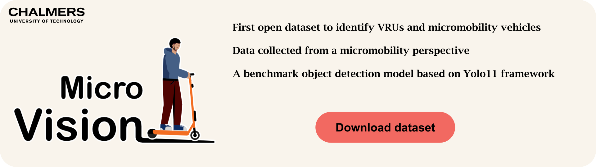
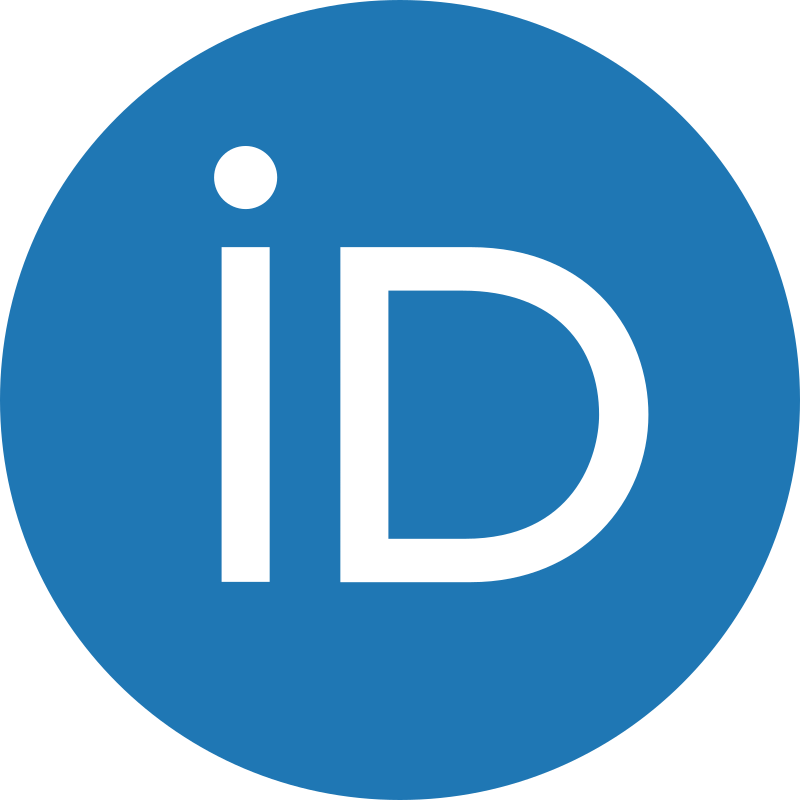
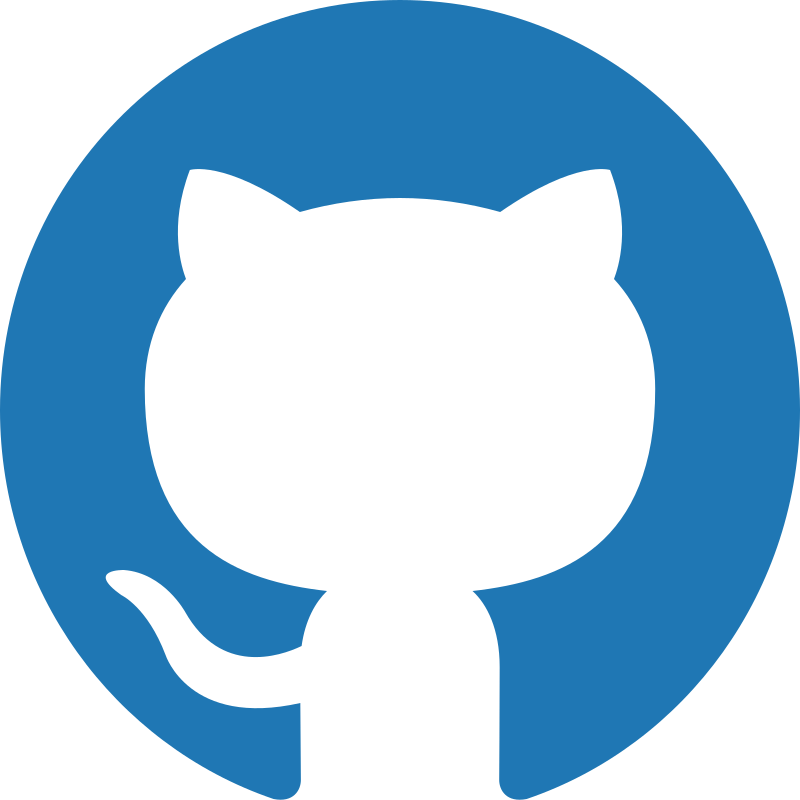

<div align="center">
  <a href="https://www.snd.se" target="_blank"> </a>
</div>

<hr>
<div align="center">
    <a href="https://arxiv.org/abs/MY-INDEX"></a>
    <a href="https://snd.se/en/catalogue/dataset/2025-ID"></a>
    <a href="https://colab.research.google.com/test.ipynb"></a>
</div>

## 📄 Documentation
### 📂 Repository Structure

The repository is organized as follows:
```
MicroVision/
├── Yolo11/                     # YOLO11 model implementation and utilities
├── YoloV7/                     # YOLOv7 model implementation and utilities
├── annotator_agreement/        # Agreement metrics calculator for annotations
├── assets/                     # Images and assets for documentation
├── README.md                   # Main documentation
```

<br>

## 📜 License

The dataset and models from this project are licensed under the [CC BY-SA 4.0](https://creativecommons.org/licenses/by-sa/4.0/) license.

If you use the dataset or the models in your research, please cite the following paper:

```bibtex
@article{Rasch2025,
  title={Microvision},
  author={Alexander Rasch and Rahul Rajendra Pai},
  journal={arXiv preprint arXiv:MY-INDEX},
  year={2025}
}
```

<br>

## ✨ Models

<details open><summary>Yolo11</summary>

Refer to the [Yolo11](https://github.com/Rahul-Pi/MicroVision/Yolo11/README.md) for usage code.

| Model                                                                                | size<br><sup>(pixels) | mAP<sup>val<br>50-95 | Speed<br><sup>CPU ONNX<br>(ms) | Speed<br><sup>T4 TensorRT10<br>(ms) | params<br><sup>(M) | FLOPs<br><sup>(B) |
| ------------------------------------------------------------------------------------ | --------------------- | -------------------- | ------------------------------ | ----------------------------------- | ------------------ | ----------------- |
| [MV_YOLO11n](https://github.com/Rahul-Pi/MicroVision/yolo11n.pt) | 640                   | 39.5                 | 56.1 ± 0.8                     | 1.5 ± 0.0                           | 2.6                | 6.5               |
| [MV_YOLO11s](https://github.com/Rahul-Pi/MicroVision/yolo11s.pt) | 640                   | 47.0                 | 90.0 ± 1.2                     | 2.5 ± 0.0                           | 9.4                | 21.5              |
| [MV_YOLO11m](https://github.com/Rahul-Pi/MicroVision/yolo11m.pt) | 640                   | 51.5                 | 183.2 ± 2.0                    | 4.7 ± 0.1                           | 20.1               | 68.0              |
| [MV_YOLO11l](https://github.com/Rahul-Pi/MicroVision/yolo11l.pt) | 640                   | 53.4                 | 238.6 ± 1.4                    | 6.2 ± 0.1                           | 25.3               | 86.9              |
| [MV_YOLO11x](https://github.com/Rahul-Pi/MicroVision/yolo11x.pt) | 640                   | 54.7                 | 462.8 ± 6.7                    | 11.3 ± 0.2                          | 56.9               | 194.9             |

- **Speed** metrics are averaged over val images using an NVIDIA A100 instance.

</details>

<details><summary>YoloV7</summary>

Refer to the [YoloV7](https://github.com/Rahul-Pi/MicroVision/YoloV7/README.md) for usage code.

| Model                                                                                        | size<br><sup>(pixels) | mAP<sup>box<br>50-95 | mAP<sup>mask<br>50-95 | Speed<br><sup>CPU ONNX<br>(ms) | Speed<br><sup>T4 TensorRT10<br>(ms) | params<br><sup>(M) | FLOPs<br><sup>(B) |
| -------------------------------------------------------------------------------------------- | --------------------- | -------------------- | --------------------- | ------------------------------ | ----------------------------------- | ------------------ | ----------------- |
| [MV_YOLOv7n](https://github.com/Rahul-Pi/MicroVision/yolo7n.pt) | 640                   | 38.9                 | 32.0                  | 65.9 ± 1.1                     | 1.8 ± 0.0                           | 2.9                | 10.4              |
| [MV_YOLOv7s](https://github.com/Rahul-Pi/MicroVision/yolo7s.pt) | 640                   | 46.6                 | 37.8                  | 117.6 ± 4.9                    | 2.9 ± 0.0                           | 10.1               | 35.5              |
| [MV_YOLOv7m](https://github.com/Rahul-Pi/MicroVision/yolo7m.pt) | 640                   | 51.5                 | 41.5                  | 281.6 ± 1.2                    | 6.3 ± 0.1                           | 22.4               | 123.3             |
| [MV_YOLOv7l](https://github.com/Rahul-Pi/MicroVision/yolo7l.pt) | 640                   | 53.4                 | 42.9                  | 344.2 ± 3.2                    | 7.8 ± 0.2                           | 27.6               | 142.2             |
| [MV_YOLOv7x](https://github.com/Rahul-Pi/MicroVision/yolo7x.pt) | 640                   | 54.7                 | 43.8                  | 664.5 ± 3.2                    | 15.8 ± 0.7                          | 62.1               | 319.0             |

- **Speed** metrics are averaged over val images using an NVIDIA A100 instance.

</details>

<br>

## 🛠 How to Use
### 🐍 Python
#### Inference

#### Training

<br>

## 📞 Contact
### Alexander Rasch
<div>
  <a href="mailto:alexander.rasch@chalmers.se"></a>
  
  <a href="https://orcid.org/0000-0001-6868-8364"></a>
</div>

### Rahul Rajendra Pai
<div>
  <a href="mailto:rahul.pai@chalmers.se"></a>
  
  <a href="https://github.com/Rahul-Pi/"></a>
  
  <a href="https://se.linkedin.com/in/rahul-pai"></a>
  
  <a href="https://orcid.org/0000-0002-1516-6930"></a>
</div>

<br>

## 🙏 Acknowledgments
We would like to thank Shiyi Qiu, Mahin Garg, and Anton Broman, for helping with processing and annotating the data, and [Marco Dozza](https://www.chalmers.se/en/persons/dozza/) for valuable discussions.
<br>
The computations were enabled by resources provided by the [National Academic Infrastructure for Supercomputing in Sweden (NAISS)](https://www.naiss.se/), partially funded by the Swedish Research Council through grant agreement no. 2022-06725.
<br>
This work was carried out in the project MicroVision, funded by Vinnova (Sweden's innovation agency), the Swedish Energy Agency, and Formas (a Swedish research council for sustainable development), through the DriveSweden program (reference number [2023-01047](https://www.drivesweden.net/en/project/microvision-development-testing-and-demonstration-real-time-support-system-electric-vehicle)).

<br>

## 🤝 Contribute
If you build any models and would like us to include them in the repository, please create a pull request or open an issue. We will review it and merge it if it meets our standards. <br><br>
If you have any suggestions or ideas, please feel free to reach out to us. We appreciate your help in making this repository better!